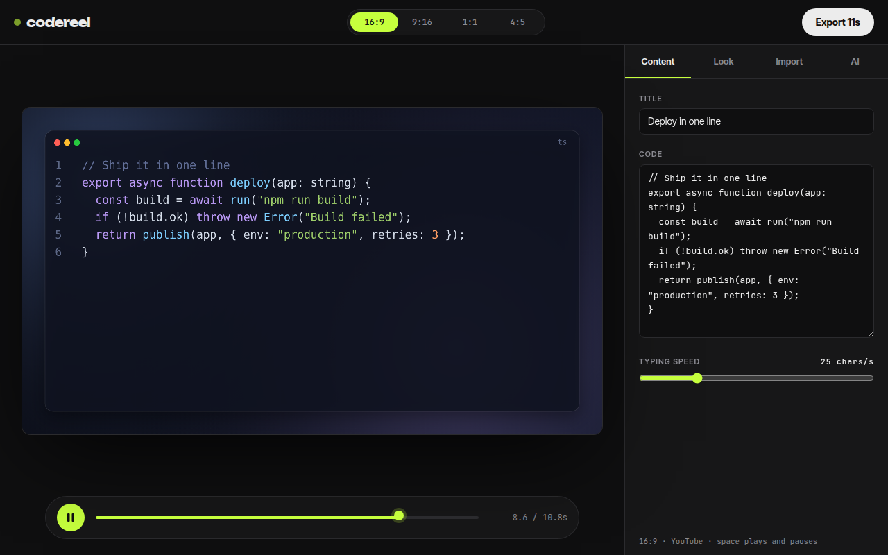
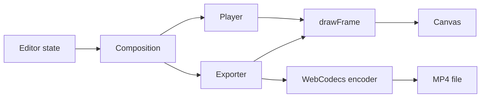

<div align="center">

# codereel

**A browser editor that turns code into short animated videos for 16:9, 9:16, 1:1 and 4:5.**

[](LICENSE)
[](https://nextjs.org)
[](https://www.typescriptlang.org)
[](https://codereel.vercel.app)

[Live demo](https://codereel.vercel.app) | [Quick start](#quick-start) | [How it works](#how-it-works) | [Docs](#documentation)



</div>

## Try it

Open **https://codereel.vercel.app**. The editor loads with an example snippet, so you can preview right away with no key and no sign-up.

1. Paste code and a title in the **Content** tab.
2. Pick a format at the top and a theme in the **Look** tab.
3. Press `Space` to preview, then **Export**. Chrome or Edge is required for export.

## Features

- **Animated code videos** with a typing effect and a title card.
- **Four formats** with an exact-ratio stage: 16:9, 9:16, 1:1 and 4:5.
- **MP4 export in the browser** with WebCodecs, up to 60 seconds.
- **Snippet from a prompt** (bring your own key) and **import** from a GitHub file range or commit diff.
- **Portable compositions** that serialize to HyperFrames-style HTML.

## How it works



Editor state produces a composition. The player and the exporter both call the same renderer with a time value, so the same composition and time always draw the same pixels. The exporter steps frame by frame and feeds a canvas source to the encoder. Full diagrams and the module map are in [docs/architecture.md](docs/architecture.md).

## Quick start

Requires Node 22 or newer.

```bash
git clone https://github.com/edgeorgie/codereel.git
cd codereel
npm ci
npm run dev
```

Open http://localhost:3000. There are no environment variables. For the prompt feature, open the **AI** tab, choose a provider and paste your own key; it stays in your browser.

[](https://vercel.com/new/clone?repository-url=https%3A%2F%2Fgithub.com%2Fedgeorgie%2Fcodereel)

## Data flow and privacy

| Data | Where it goes | Stored |
|---|---|---|
| Code and titles | Stay in the browser | Not stored |
| Provider key | Sent only to the chosen provider | `sessionStorage` by default; `localStorage` only if you choose to remember it on this device |
| GitHub import URL | Public raw file and API requests | Not stored |

A model reply is parsed as JSON and validated; its text is drawn on a canvas, never inserted as HTML. The only prompt is the user's own description.

## Limits

- Export needs WebCodecs (Chrome or Edge).
- Compositions are capped at 60 seconds.
- Public GitHub repositories only for import.

## Tech stack

Next.js 16 (App Router), React 19, TypeScript, Tailwind CSS 4, canvas 2D rendering and mediabunny for MP4 muxing with WebCodecs. Client-side only; no backend.

## Scripts

| Script | Purpose |
|---|---|
| `npm run dev` | Development server |
| `npm run build` | Production build |
| `npm run typecheck` | TypeScript check |
| `npm run lint` | ESLint |
| `npm test` | Unit tests |
| `npm run spec:check` | Traceability gate |
| `npm run verify` | All of the above |
| `npm run deploy:pages` | Static export to the `gh-pages` branch |

## Deployment

The app is fully client-side, so it can be hosted as static files.

- **GitHub Pages:** `npm run deploy:pages` builds a static export and publishes it to the `gh-pages` branch. Enable Pages from that branch; on a free plan the repository must be public.
- **Vercel or any Node host:** use the Deploy button above. No configuration is needed.

## Key concepts

| Term | Meaning |
|---|---|
| Composition | A stage size, frame rate and a list of timed clips. The single source for preview and export. |
| Clip | A timed element (title or code) with a start, duration and track. |
| Deterministic frame | The same composition and time always draw the same pixels, so export is repeatable. |
| WebCodecs | Browser API that encodes video frames. It is why export needs Chrome or Edge. |
| HyperFrames format | HTML with a stage element and timed clip elements that carry data attributes. |
| Aspect preset | One of four named sizes: 16:9, 9:16, 1:1, 4:5. |

## Design system

Typography: Display, Unbounded; Text, Inter Tight; Code, JetBrains Mono.

| Token | Value | Use |
|---|---|---|
| `bg` | `#0f0f10` | Page background |
| `panel` | `#171718` | Sidebar and dock |
| `raise` | `#202022` | Raised surfaces |
| `line` | `#2b2b2e` | Borders |
| `text` | `#ececec` | Primary text |
| `muted` | `#8b8b92` | Secondary text |
| `lime` | `#c6ff3d` | Single accent for focus and actions |

- The canvas is the protagonist; controls recede.
- One accent color, no gradients or glass.
- Space plays and pauses.

Motion, components and rationale: [docs/design-system.md](docs/design-system.md).

## Documentation

| Document | What it answers |
|---|---|
| [docs/index.md](docs/index.md) | Map of all documentation |
| [docs/architecture.md](docs/architecture.md) | Diagrams and modules |
| [docs/spec/spec.md](docs/spec/spec.md) | Requirements and acceptance criteria |
| [docs/spec/traceability.md](docs/spec/traceability.md) | Requirement to code, test and evidence |
| [docs/design-system.md](docs/design-system.md) | Tokens, motion, components |
| [docs/glossary.md](docs/glossary.md) | Definitions |
| [docs/evaluation.md](docs/evaluation.md) | Self-assessment against a review rubric |
| [docs/adr](docs/adr) | Decision records |

## For AI agents and tools

- [AGENTS.md](AGENTS.md) defines the workflow and quality gates for agents and people.
- [llms.txt](public/llms.txt) is served at `/llms.txt` when deployed and points to the key documents.
- [docs/spec/requirements.json](docs/spec/requirements.json) is the machine-readable requirement list with status, files and tests.
- `npm run verify` is the single deterministic gate: typecheck, lint, traceability check, tests and build.

## Contributing

See [CONTRIBUTING.md](CONTRIBUTING.md). Security reports: [SECURITY.md](SECURITY.md).

## License

[MIT](LICENSE). Uses mediabunny (MPL-2.0).
