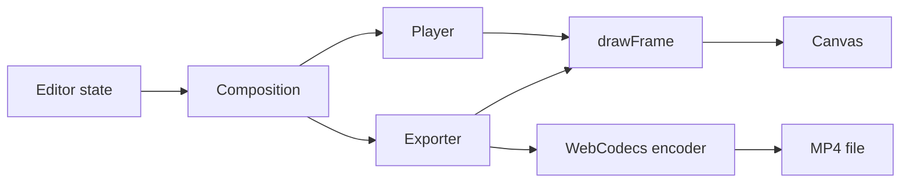
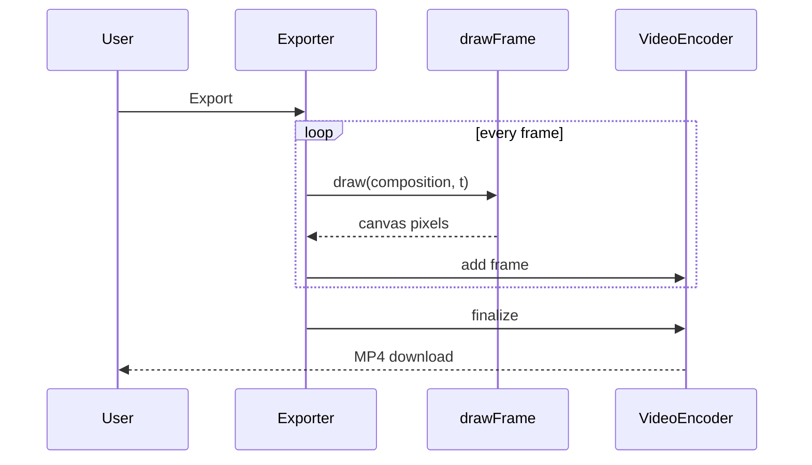

# Architecture

## Data flow

## Main sequence

## Modules

| Path | Responsibility |
|---|---|
| `lib/scene.ts` | Composition model, validation, presets |
| `lib/render.ts` | Canvas drawing for a given time |
| `lib/export.ts` | Frame loop and H.264 encoding via WebCodecs |
| `lib/html.ts` | HTML serialization and parsing |
| `lib/github.ts` | URL parsing and fetching snippets |
| `lib/promptScene.ts` | Prompt and tolerant reply parsing |
| `components/` | Player, panels |
| `app/page.tsx` | Studio layout and state |

## Principles

- Pure logic lives in `lib/` and is tested without a browser; components stay thin.
- Network, storage and model replies are validated at the boundary.
- Secrets and user content stay in the browser.

## Decisions

- [Render in the browser with WebCodecs](adr/0001-render-in-the-browser-with-webcodecs.md)
- [Canvas for output, deterministic by time](adr/0002-canvas-for-output-deterministic-by-time.md)
